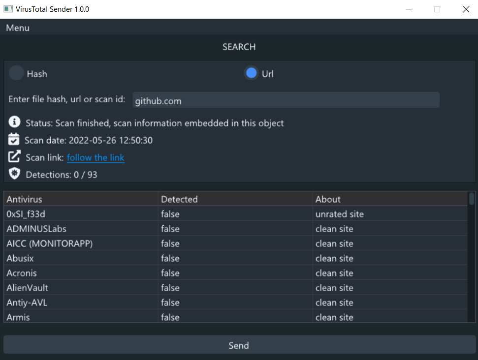

VirusTotal Sender is a Windows desktop application that interacts with VirusTotal
using its API v2.

Main Features
---
- Get info about a file by its hash (MD5, SHA-1, SHA-256) or scan id
- Get info about a url by its name or scan id
- Select a file to scan from "File menu"
- Scan a url

Downloads
---
Pre-compiled: https://github.com/sergoutre/VirusTotalSender/releases

Requirements
---
- [DirectX 9](https://www.microsoft.com/en-us/download/35)

Author
---
- [sergoutre](https://github.com/sergoutre)
